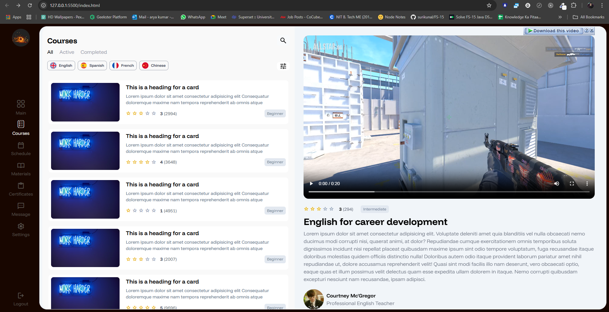

# Project Name

A simple and responsive project built using **HTML** and **TailwindCSS**. This project demonstrates the use of TailwindCSS for styling and layout, creating a visually appealing and mobile-friendly user interface.

---

## Table of Contents

- [Overview](#overview)
- [Features](#features)
- [Technologies Used](#technologies-used)
- [Screenshots](#screenshots)
- [Setup](#setup)
- [Usage](#usage)
- [Contributing](#contributing)
- [License](#license)

---

## Overview

This project is designed to showcase the power of TailwindCSS in creating responsive and modern designs with minimal effort. It is suitable for learning purposes, portfolio projects, or as a starting point for larger applications.

---

## Features

- Responsive layout for various screen sizes
- Clean and modern UI design
- Fully styled using TailwindCSS utility classes

---

## Technologies Used

- **HTML5**: For the structure of the web pages.
- **TailwindCSS**: For styling and layout.

---

## Screenshots

### Desktop View



---

## Setup

1. Clone the repository:

   ```bash
   git clone https://github.com/7ommyShelby/TailwinDJS.git
   ```

2. Navigate to the project folder:

   ```bash
   cd your-repo
   ```

3. Open the `index.html` file in your browser:

   ```bash
   open index.html
   ```

---

## Usage

- Open the `index.html` file in your browser to view the project.
- Modify the `index.html` and `style.css` files to customize the content and design.

---

## Contributing

Contributions are welcome! Please follow these steps:

1. Fork the repository.
2. Create a new branch for your feature or bug fix.
3. Commit your changes and push them to your branch.
4. Submit a pull request.

---

## License

This project is licensed under the [MIT License](LICENSE).

---

## Acknowledgements

- [TailwindCSS Documentation](https://tailwindcss.com/docs)
- [HTML5 Documentation](https://developer.mozilla.org/en-US/docs/Web/HTML)
